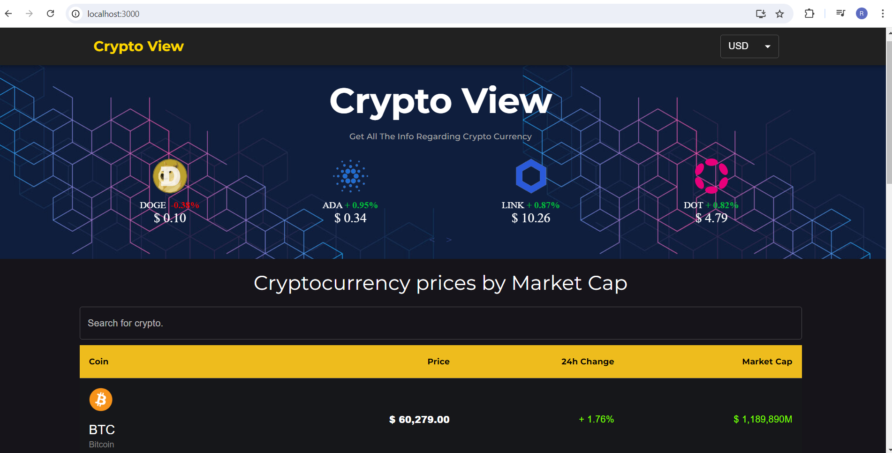

# Project Name
Crypto Viewer is a powerful and responsive React application designed to provide users with real-time cryptocurrency data at their fingertips. The app offers a comprehensive overview of the cryptocurrency market by displaying current prices, showcasing trending cryptocurrencies, and visualizing historical data through interactive charts.


### Screenshots
1. Homepage:


2.  CoinView:


3. Pagination:


## Built with 

- [React JS](https://reactjs.org/)
- [Material UI](https://v4.mui.com/)
- [Chart JS](https://reactchartjs.github.io/react-chartjs-2/#/)

### Prerequisites

- Node.js 
- npm

### Steps

1. Clone the repository:

   ```bash
   git clone https://github.com/Roopesh-N/Crypto_view.git
   cd crypto_view

### Contributing
If you want to contribute to this project, follow these steps:

Fork the repository.
Create a new branch: git checkout -b feature/YourFeatureName.
Make your changes and commit them: git commit -m 'Add some feature'.
Push to the branch: git push origin feature/YourFeatureName.
Submit a pull request.

### Key features of the application include:

Live Cryptocurrency Prices: Stay up-to-date with the latest prices for your favorite cryptocurrencies.
Trending Cryptos: Discover which cryptocurrencies are making waves in the market.
Historical Data: View and analyze historical price data through interactive charts, allowing for a deeper understanding of market dynamics.
Responsive Design: Enjoy a consistent and optimal viewing experience on any device, from desktops to smartphones.